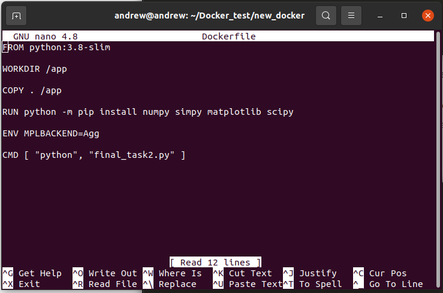
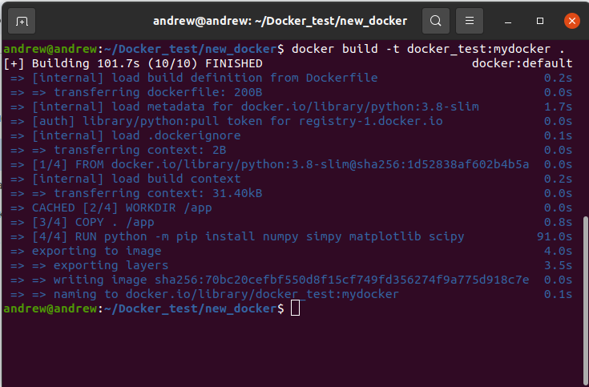

# Docker_test
## Установка Docker и Docker compose

#### Подготовка к установке Docker
Для подготовки к установке Dockerвыполните следующие действия:
 Обновите индекса пакетов с помощью команды 
 ```bash
  sudo apt-get update
 ```
 Выполните установку пакетов с помощью команды
 ```bash
 sudo apt-get install ca-certificates curl gnupg
 ```
Добавьте GPG-ключ в Docker с помощью команд:
```bash
sudo install -m 0755 -d /etc/apt/keyrings
curl -fsSL https://download.docker.com/linux/ubuntu/gpg | sudo gpg --dearmor -o /etc/apt/keyrings/docker.gpg
sudo chmod a+r /etc/apt/keyrings/docker.gpg
```
Добавьте репозиторий Docker в источники Apt с помощью команд :
```bash 
echo \ "deb [arch="$(dpkg --print-architecture)" signed-by=/etc/apt/keyrings/docker.gpg] https://download.docker.com/linux/ubuntu \
"$(. /etc/os-release && echo "$VERSION_CODENAME")" stable" | \ 
sudo tee /etc/apt/sources.list.d/docker.list > /dev/null
```
Обновите индекс пакетов с помощью команды
```bash
sudo apt-get update:
```

Если все сделано правильно, то в терминале будет выведен результат последовательного выполнения команд, аналогичный показанному на рисунке 1.


Рисунок 1 Подготовка к установке docker


#### Установка Docker
Для установки docker введите команду 
```bash
sudo apt-get install docker-ce docker-ce-cli containerd.io docker-buildx-plugin docker-compose-plugin. 
```
В процессе установки в терминал будет выведена информация о процессе усановки как показано на рисунке 2


Рисунок  2 . Процесс установки docker

Для проверки правильности установки запустите команду
```bash
 sudo docker run hello-world.
 ```
Если все сделано верно, то в терминал будет выведен результат запуска контейнера hello-world как показано на рисунке 3.


Рисунок  3 . Результат вызова команды docker run hello-world

#### Настройка Docker для работы без прав root

Для настройки Docker для работы без прав root (добавления пользователя в группу docker) необходимо выполнить следующие действия:
 Создайте Unix-группу пользователей с именем docker с помощью команды 
```bash
sudo groupadd docker
```
После этого добавьте пользователя ```$USER``` в группу docker с помощью команды 
```bash
sudo usermod -aG docker $USER
```
Далее выполните активацию изменений с помощью команды
```bash
newgrp docker
```
Результат выполнения команд, приведенных в п. 1 - 3 представлен на рисунке 4


Рисунок 4.  Добавление пользователя в группу и активация изменений. 

Выполните проверку добавления пользователя в группу docker с помощью команды 
```bash
docker run hello-world
```
Если запуск прошел успешно, то в терминал будут выведены сообщения, аналогичные показанным на рисунке 5. Отметим, что выполнение  команды от имени суперпользователя (ввод sudo) теперь не требуется. 


Рисунок  5.  Выполнение тестовой проверки запуска докера.


#### Установка Docker Compose. 
Для установки Docker compose необходимо выполнить следующие действия:
1. Для загрузки версии 2.23.0 и сохранения исполняемого файла в папку /usr/local/bin/docker-compose запустите команду 
```bash
sudo curl -L "https://github.com/docker/compose/releases/download/v2.23.0/docker-compose-linux-x86_64" -o /usr/local/bin/docker-compose
```
 
2.   Установите права на исполнение для файла docker-compose с помощью команды 
```bash
sudo chmod +x /usr/local/bin/docker-compose
```
3.    Проверьте корректность установки с помощью команды
```bash 
docker-compose --version
```
 Если установка выполнялась корректно, то в терминал поледовательно будет выведена информация, показанная на рисунке 6. 


 Рисунок 6. Последовательность установки Docker Compose


#### Разработка программы на языке Python для дальнейшей работы в Docker
С целью тестирования работы в Docker на языке Python была написана программа для расчета траектории тела,брошенного под углом к горизонту при заданной начальной скорости. Текст программы представлен в репозитории проекта. С файлом можно ознакомиться [здесь](new_docker/final_task2.py). Результат работы программы представлен на рисунке 7.


Рисунок 7. Результат запуска программы в среде VS Code для демонстрации работоспособности программы.

#### Создание Docker образа для программы
Для создания Docker образа выполните следующие действия:
Создайте директорию `Docker test` c помощью команды 
```bash
mkdir Docker_test
```
Перейдите в созданную директорию с помощью команды
```bash
cd Docker_test
```
Создайте файл с инструкциями для Docker помощью команды 
```bash
touch Dockerfile
```
Пример содержимого файла показан на рисунке 8. 



Рисунок 8. Содержимое файла Dockerfile

Рассмотрим подробнее содержимое файла Dockerfile:

**Инструкция `FROM python:3.8-slim`** предназначена для определения базового образа, на котором будет строиться текущий образ, а именно `python 3.8-slim`, имеющий несколько меньший объем, чем `python 3.8`

**Инструкция `WORKDIR /app`** создает рабочий каталог `app` внутри контейнера. 

**Инструкция `COPY . /app`** копирует содержимое папки в директорию `app`

**Инструкция `RUN python -m pip install numpy simpy matplotlib scipy`** устанавливает пакеты `numpy, simpy, mathplotlib, scipy` для работы файла `final-task2.py`.

**Инструкция `ENV MPLBACKEND=Agg`** устанавливает переменную окружающей среды и настраивает бэкенд для вывода графика. В данном случае получилось вывести график, который строит `matplotlib`,  в отдельный файл, который называется `myfile.png`. Для использования бэкенда `Agg` в тексте программы добавлены строки 
```bash
import matplotlib
matplotlib.use('Agg')
```
Для вывода рисунка в файл в директории `app`вместо строки 
`plt.show()` необходимо добавить строку 
```bash
plt.savefig('/app/myplot.png')
```  
**Инструкция CMD ``[ "python", "final_task2.py" ]``** запускает программу [final-task2.py](new_docker/final_task2.py).

Соберите докер образ с помощью команды 
```bash
docker build -t docker_test:mydocker
``` 
Флаг `-t` присваивает имя и тэг собираемому контейнеру. В данном случае контейнеру присвоено имя  `docker_test` и тэг `mydocker`.
В процессе сборки образа в терминал будут выводиться сообщения, аналогичные показанным на рсиунке 9.


Рисунок 9. Процесс сборки образа

По окончании сборки будет выведено сообщение FINISHED




Рисунок 10. Окончание сборки образа

Выведите список образов с помощью команды
```bash
docker image ls
```
Созданный в качестве примера образ апоказан в верхней строчке на рисунке 11


Рисунок 11 Выполнение команды docker image ls и вывод имеющихся образов


#### Запуск и тестирование приложения в Docker контейнере

Выполните запуск приложения в докер контейнере с помощью команды 
```bash
docker run -v $(pwd):/app docker_test:mydocker. 
```
Флаг `-v $(pwd):/app` монтирует текущую рабочую директорию  в директорию `/app` внутри контейнера, позволяя получить доступ к создаваемому программой графику, который выводится в виде графического файла с расширением `.png`. 


Рисунок 12. Запуск докера

После запуска докера программа вывела в терминал текст `Done`. В тексте программы для этого была добавлена строка
```bash
print (“Done”)
```
В рабочей директории '~/Docker_test/new_docker' создан файл 'myfile.png', содержащий график 'matplotlib' как показано на рисунке 13.  


Рисунок 13. Созданный рисунок в рабочей директории

#### Работа в Docker compose
Для запуска docker контейнера с программой создадим файл `docker-compose.yml` с помощью редактора `nano`. Содержимое файла представлено на рисунке 14.


Рисунок 14. Содержимое файла docker-compose.yml

Рассмотрим содержимое файла:
**version** версия 2
**services:** - основной раздел, где создаются и описываются сервисы (контейнеры `docker`). В данном примере сервис один. Он имеет имя `container`.
**image:** имя готового образа, который будет использоваться для создания контейнера. Он был собран ранее и имеет имя `docker_test` и тэг `mydocker`.
**volumes:** монтирование папок. Здесь монтируется локальный каталог `~/Docker_test/new_docker` на хосте внутрь контейнера в качестве каталога `/app`.
**environment:** переменные окружения. Выполняется настройка бэкэнда. Переменной `MPLBACKEND` присвоено значение `Agg`.
	
Для запуска контейнера в окне терминала введите команду
```bash
docker-compose up
```
Результат выполнения команды представлен на рисунке 15.


Рисунок 15. Результат выполнения команды docker-compose up

Если все выполнено правильно, в результате работы программы в папке `~/Docker_test/new_docker` будет создан файл `myfile.png` с графиком. 


